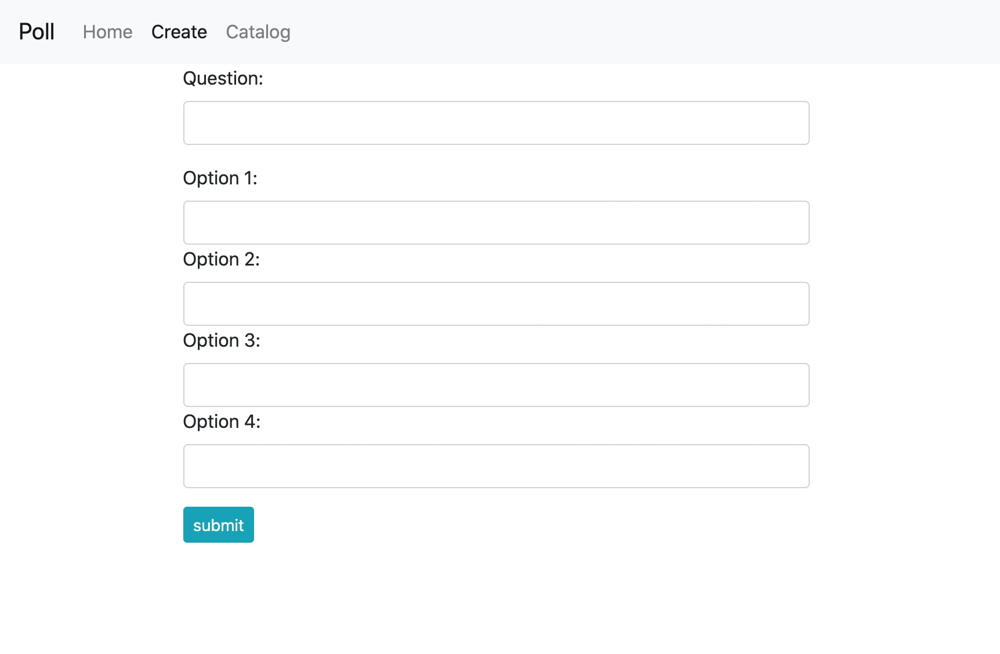
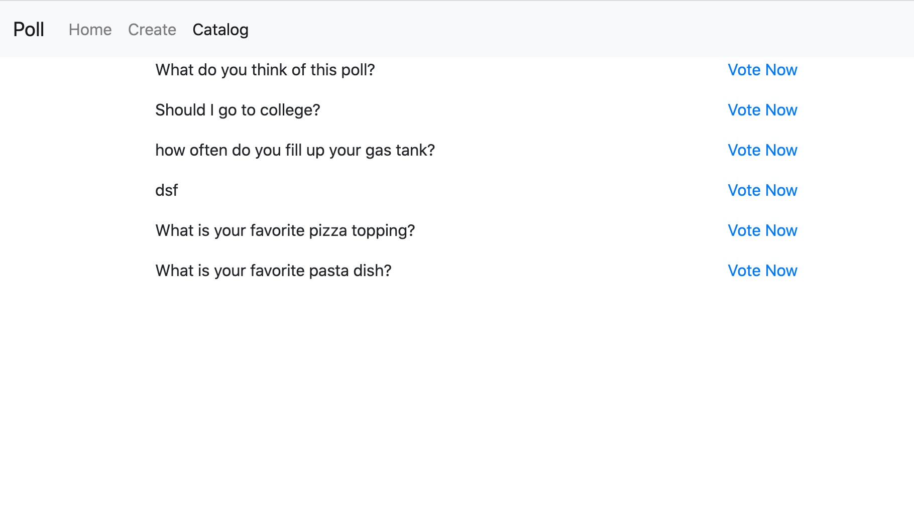
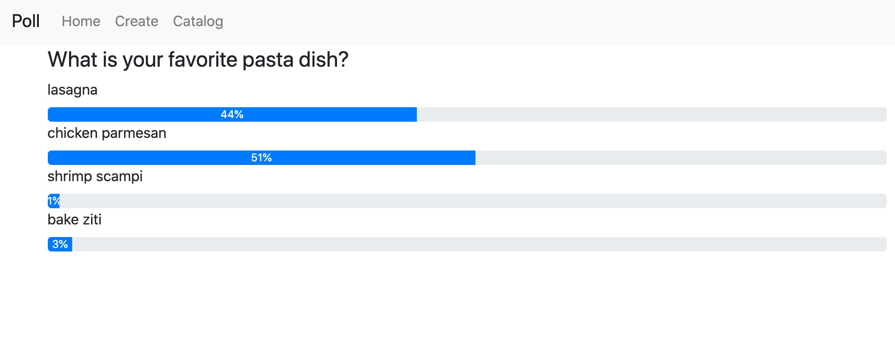

# createapoll
## Node.js app with http server, database connection, and routing. 

[View Demo on Heroku](https://pollpoll.herokuapp.com)

This app uses the firebase real time database. Users can create a custom poll or select from an existing poll.
After creating a poll, a poll id is auto generated in which the user can come back to track results.

